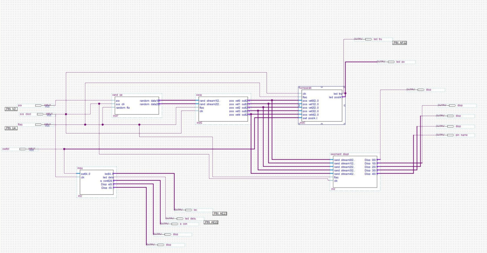

# Password recognizer with random input
Password recognizer with random generation solved with Linear feedback shift register on FPGA Cyclone II. The user have to insert the correct password via switches. After 10 seconds, the password inserted is compared with the correct one. If the password is correct a green led turn up, otherwise a red led turn up and an error message "Er" is shown on the 7-segments displays. The last switch of the board is used to start a generation of random numbers used to insert again the password numbers but in a different order. The order is shown using the 7-segments displays. If the user insert again the password elements in the correct order, another green led turn up.

  

# Requirements

- FPGA Cyclone II
- Quartus II

# File organization

The repository contains all the .vhd files that have to be loaded inside a Quartus II project. The starting point is the *main.vhd* that call all the following elements:

- *comparator.vhd*: compare the shuffled input password with the correct one.
- *counter.vhd*: define the internal clock of the board. The Cyclone II clock works at 50 MHz, thus each period last 0.02 microseconds. Since we need to count up to 10 seconds we need 5 * 10^8 counts, log2 of this number return the number of bits we need for our counter, that is 29.
- *input.vhd*: save the input values of the switches after 10 seconds.
- *main.vhd*: starting point of the project.
- *rand_gen.vhd*: generate the positions to swap in order to shuffle the password order.
- *segment_display.vhd*: control the 7-segment displays.
- *swap.vhd*: swap the two random generated positions of the password.

